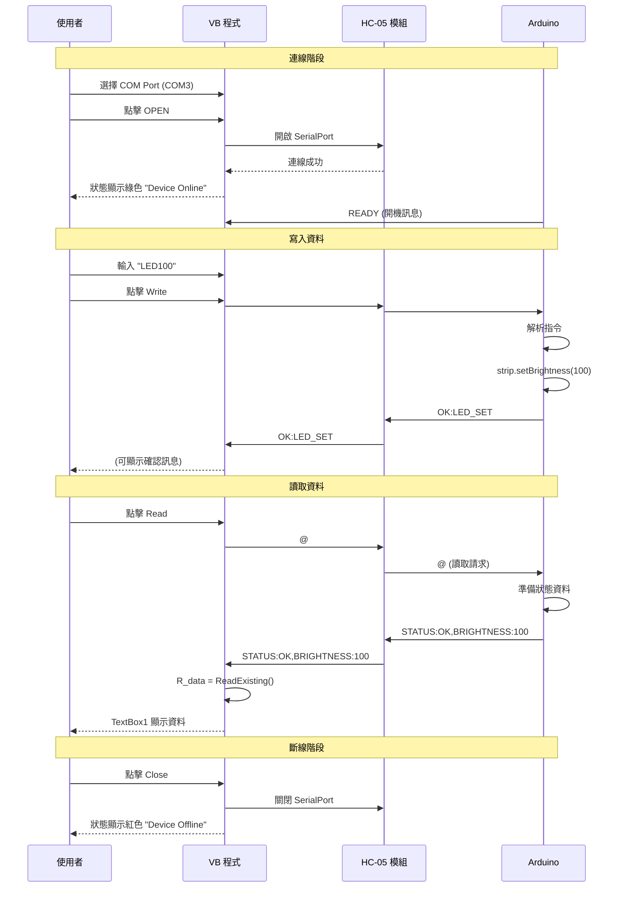

# VB 與 Arduino HC-05 藍牙通訊分析報告

**專案名稱**: 114工科賽 藍牙控制系統  
**分析日期**: 2025年11月5日  
**通訊模組**: HC-05 藍牙模組  
**PC 端**: Visual Basic .NET (SerialPort 通訊)  
**Arduino 端**: Arduino Uno + ATmega328P

---

## 📋 目錄

1. [系統架構總覽](#系統架構總覽)
2. [VB 程式分析](#vb-程式分析)
3. [Arduino 程式狀況](#arduino-程式狀況)
4. [通訊協定分析](#通訊協定分析)
5. [資料流程圖](#資料流程圖)
6. [程式碼對應關係](#程式碼對應關係)
7. [建議改進方案](#建議改進方案)

---

## 系統架構總覽

### 🔗 完整通訊架構

```
┌─────────────────────────────────────────────────────────────────┐
│                     PC 端 (Visual Basic)                         │
│  ┌────────────────────────────────────────────────────────┐     │
│  │  Form1.vb                                              │     │
│  │  - COM Port 選擇                                        │     │
│  │  - 連線/斷線控制                                        │     │
│  │  - Write_Data(RS, W_data)  發送資料                    │     │
│  │  - Read_Data(RS)  接收資料                             │     │
│  └────────────────────────────────────────────────────────┘     │
│                          ↕                                       │
│  ┌────────────────────────────────────────────────────────┐     │
│  │  SerialPort1                                           │     │
│  │  - ReadTimeout: 1000ms                                 │     │
│  │  - WriteTimeout: 1000ms                                │     │
│  │  - BaudRate: 9600 (預設)                               │     │
│  └────────────────────────────────────────────────────────┘     │
└─────────────────────────────────────────────────────────────────┘
                          ↕
            藍牙無線傳輸 (HC-05)
                          ↕
┌─────────────────────────────────────────────────────────────────┐
│               Arduino Uno (ATmega328P)                          │
│  ┌────────────────────────────────────────────────────────┐     │
│  │  ❌ 目前 main.cpp 沒有藍牙通訊功能                      │     │
│  │  ❌ 缺少 Serial.begin()                                 │     │
│  │  ❌ 缺少 Serial.read() / Serial.write()                │     │
│  │  ✅ 只有選單與 LED 顯示功能                             │     │
│  └────────────────────────────────────────────────────────┘     │
└─────────────────────────────────────────────────────────────────┘
```

---

## VB 程式分析

### 📂 **檔案結構**

```
VB_bluethoot-20251031/
├── 20240828.sln           (解決方案檔)
└── 20240826/
    ├── Form1.vb           (主程式邏輯)
    ├── Form1.Designer.vb  (UI 設計)
    └── My Project/        (專案設定)
```

---

### 🎨 **使用者介面設計**

#### **視窗標題**
```vb
"111 學年度 工業類科學生技藝競賽 電腦修護職種 第二站 崗位號碼:24"
```

#### **介面元件配置**

| 元件 | 名稱 | 功能 | 初始狀態 |
|------|------|------|---------|
| **GroupBox1** | Device Connect | 裝置連接控制 | 啟用 |
| ComboBox1 | COM Port 選擇 | 選擇藍牙 COM 埠 | 啟用 |
| OPEN 按鈕 | 開啟連線 | 建立藍牙連接 | 啟用 |
| Close 按鈕 | 關閉連線 | 斷開藍牙連接 | 停用 |
| Label2 | Device Status | 顯示連線狀態 | 紅色 "Device Offline" |
| **GroupBox2** | BT SerialPort_Data | 資料收發控制 | 停用 |
| BT_Data | 輸入文字框 | 輸入要發送的資料 | 啟用 |
| BT_Write | 寫入按鈕 | 發送資料到 Arduino | 啟用 |
| TextBox1 | 接收文字框 | 顯示從 Arduino 讀取的資料 | 唯讀 |
| BT_Read | 讀取按鈕 | 從 Arduino 讀取資料 | 啟用 |
| Label_time | 時間顯示 | 顯示目前系統時間 | 即時更新 |

---

### 💻 **主要函式分析**

#### **1. Form1_Load() - 表單載入事件**

```vb
Private Sub Form1_Load(sender As Object, e As EventArgs) Handles MyBase.Load
    ComboBox1.Enabled = True        ' 啟用 COM Port 選擇
    OPEN.Enabled = True             ' 啟用開啟按鈕
    Close.Enabled = False           ' 停用關閉按鈕
    GroupBox2.Enabled = False       ' 停用資料收發區
    ComboBox1_Ports()               ' 掃描可用的 COM Port
End Sub
```

**功能**：
- 初始化介面狀態
- 自動掃描並列出可用的 COM Port

---

#### **2. ComboBox1_Ports() - COM Port 掃描**

```vb
Private Sub ComboBox1_Ports()
    ComboBox1.Items.Clear()         ' 清空下拉選單
    com_cnt = 0                     ' 重置計數器
    
    ' 遍歷系統所有序列埠
    For Each com As String In My.Computer.Ports.SerialPortNames
        SerialPort1.PortName = com
        Try
            ComboBox1.Items.Add(com)     ' 加入到選單
            com_buf(com_cnt) = com       ' 儲存到陣列
            com_cnt = com_cnt + 1
        Catch ex As Exception
            ' 忽略無法開啟的埠
        End Try
    Next
End Sub
```

**功能**：
- 掃描電腦上所有可用的 COM Port
- 將結果顯示在下拉選單中
- 典型結果：COM1, COM3, COM5 等

**實際範例**：
```
可用 COM Port:
- COM1 (可能是其他裝置)
- COM3 (HC-05 藍牙模組)  ← 選擇這個
- COM5 (USB 轉接器)
```

---

#### **3. OPEN_Click() - 開啟藍牙連線**

```vb
Private Sub OPEN_Click(sender As Object, e As EventArgs) Handles OPEN.Click
    ' 設定選定的 COM Port
    SerialPort1.PortName = com_buf(ComboBox1.SelectedIndex)
    
    Try
        SerialPort1.Open()              ' 開啟序列埠
        GroupBox2.Enabled = True        ' 啟用資料收發區
        ComboBox1.Enabled = False       ' 停用 COM Port 選擇
        OPEN.Enabled = False            ' 停用開啟按鈕
        Close.Enabled = True            ' 啟用關閉按鈕
        Label2.Text = "Device Online"   ' 更新狀態文字
        Label2.BackColor = Color.Green  ' 狀態顯示綠色
    Catch ex As Exception
        MsgBox("連線失敗")              ' 顯示錯誤訊息
    End Try
End Sub
```

**執行流程**：
```
使用者點擊 OPEN
    ↓
設定 COM Port (例如 COM3)
    ↓
嘗試開啟序列埠
    ↓
成功 → 啟用資料收發區，狀態顯示綠色
失敗 → 顯示「連線失敗」對話框
```

---

#### **4. Close_Click() - 關閉藍牙連線**

```vb
Private Sub Close_Click(sender As Object, e As EventArgs) Handles Close.Click
    SerialPort1.Close()             ' 關閉序列埠
    ComboBox1.Enabled = True        ' 啟用 COM Port 選擇
    GroupBox2.Enabled = False       ' 停用資料收發區
    OPEN.Enabled = True             ' 啟用開啟按鈕
    Label2.Text = "Device Offline"  ' 更新狀態文字
    Label2.BackColor = Color.Red    ' 狀態顯示紅色
End Sub
```

**功能**：
- 中斷藍牙連線
- 恢復初始介面狀態

---

#### **5. Write_Data() - 發送資料函式** ⭐

```vb
Sub Write_Data(ByVal RS As Char, ByVal W_data As String)
    Try
        If SerialPort1.IsOpen Then          ' 檢查序列埠是否開啟
            SerialPort1.Write(RS)           ' 先發送控制字元
            SerialPort1.Write(W_data)       ' 再發送資料內容
        End If
    Catch ex As TimeoutException
        MsgBox("Write operation timed out. Check device connection.")
    End Try
End Sub
```

**參數說明**：
- `RS` (Char)：控制字元，用於識別資料類型
- `W_data` (String)：實際要發送的資料

**發送格式**：
```
控制字元 + 資料內容
```

**範例**：
```vb
Write_Data("#", "Hello")  → 發送: #Hello
Write_Data("#", "LED:ON") → 發送: #LED:ON
```

---

#### **6. Read_Data() - 接收資料函式** ⭐

```vb
Function Read_Data(ByVal RS As Char)
    Dim R_data As String = ""
    SerialPort1.Write(RS)               ' 發送讀取請求字元
    
    ' 持續等待直到收到資料
    Do While R_data = ""
        R_data = SerialPort1.ReadExisting   ' 讀取緩衝區所有資料
    Loop
    
    Return R_data                       ' 回傳接收到的資料
End Function
```

**功能流程**：
```
1. 發送讀取請求字元 (例如 "@")
2. 等待 Arduino 回應
3. 讀取接收緩衝區的所有資料
4. 回傳資料給呼叫者
```

**潛在問題**：
- ⚠️ `Do While` 無窮迴圈可能導致程式卡死
- ⚠️ 如果 Arduino 沒有回應，VB 程式會永久等待
- ⚠️ 缺少逾時機制

---

#### **7. BT_Write__Click() - 寫入按鈕事件**

```vb
Private Sub BT_Write__Click(sender As Object, e As EventArgs) Handles BT_Write.Click
    Dim out_data As String = BT_Data.Text   ' 取得輸入框的文字
    Write_Data("#", out_data)               ' 發送資料（使用 # 控制字元）
End Sub
```

**使用範例**：
```
使用者在 BT_Data 輸入框輸入: LED100
點擊 Write 按鈕
    ↓
實際發送到 Arduino: #LED100
```

---

#### **8. BT_Read_Click() - 讀取按鈕事件**

```vb
Private Sub BT_Read_Click(sender As Object, e As EventArgs) Handles BT_Read.Click
    TextBox1.Text = Read_Data("@")  ' 發送 @ 請求，並顯示回應
End Sub
```

**使用範例**：
```
使用者點擊 Read 按鈕
    ↓
VB 發送: @
    ↓
Arduino 回應: STATUS:OK
    ↓
TextBox1 顯示: STATUS:OK
```

---

#### **9. Timer1_Tick() - 時間更新計時器**

```vb
Private Sub Timer1_Tick(sender As Object, e As EventArgs) Handles Timer1.Tick
    Label_time.Text = "Current Time : " & DateAndTime.Now
End Sub
```

**設定**：
- 間隔：1000ms (1 秒)
- 功能：每秒更新時間顯示

---

### 📊 **SerialPort1 設定**

```vb
' Form1.Designer.vb 中的設定
Me.SerialPort1.ReadTimeout = 1000   ' 讀取逾時 1 秒
Me.SerialPort1.WriteTimeout = 1000  ' 寫入逾時 1 秒
```

**預設參數** (未明確設定，使用 .NET 預設值)：
- **BaudRate**: 9600 bps
- **DataBits**: 8
- **Parity**: None
- **StopBits**: One

---

## Arduino 程式狀況

### ⚠️ **目前狀況：藍牙功能未實作**

#### **現有程式內容**

```cpp
// 檔案：src/main.cpp

void setup() {
  // ❌ 沒有 Serial.begin(9600);
  // ❌ 沒有任何序列埠初始化
  
  timer_ini(34286);
  pinMode(RLED_PIN, OUTPUT);
  strip.begin();
  // ... TFT 初始化等
}

void BLE() {
  // ❌ 只有選單操作
  // ❌ 沒有 Serial.available()
  // ❌ 沒有 Serial.read()
  // ❌ 沒有 Serial.write()
  
  tft_w(0, 50, 9, ST77XX_RED, "Connect", 0);
  
  // 只有按鍵選單邏輯...
  while (1) {
    if ((millis() - kt) > 20) {
      // 按鍵處理
    }
  }
}
```

#### **缺少的功能清單**

| 功能項目 | 狀態 | 說明 |
|---------|------|------|
| Serial 初始化 | ❌ 未實作 | 需要 `Serial.begin(9600)` |
| 接收 VB 指令 | ❌ 未實作 | 需要 `Serial.available()` 和 `Serial.read()` |
| 發送回應資料 | ❌ 未實作 | 需要 `Serial.println()` |
| 指令解析 | ❌ 未實作 | 需要解析 `#` 和 `@` 控制字元 |
| 資料處理 | ❌ 未實作 | 需要根據指令執行對應動作 |

---

## 通訊協定分析

### 📡 **VB 端的通訊協定**

#### **1. 寫入模式 (Write)**

```
格式: # + 資料內容

範例:
VB 發送: #LED100
VB 發送: #TIME:14:30:00
VB 發送: #BRIGHTNESS:128
```

**控制字元**: `#` (ASCII 35)

**用途**: 
- 從 PC 向 Arduino 發送控制指令
- 資料內容由使用者在 `BT_Data` 輸入框輸入

---

#### **2. 讀取模式 (Read)**

```
VB 發送請求: @
Arduino 應回應: (任意資料)

範例:
VB → Arduino: @
Arduino → VB: STATUS:OK
VB → Arduino: @
Arduino → VB: TEMP:25.5
```

**控制字元**: `@` (ASCII 64)

**用途**:
- VB 主動向 Arduino 請求資料
- Arduino 需要回傳狀態或感測器數值

---

### 🔄 **通訊流程時序圖**

#### **寫入流程**

```
時間  VB 程式                        Arduino
 │
 │    使用者輸入 "LED100"
 │    點擊 Write 按鈕
 │    ↓
 ├───→ Write_Data("#", "LED100")
 │    ↓
 ├───→ SerialPort1.Write("#")  ───────→ (應接收 '#')
 ├───→ SerialPort1.Write("LED100") ───→ (應接收 "LED100")
 │                                       ↓
 │                                   (應解析指令)
 │                                   (應執行 LED 控制)
 │                                   (可選：回傳確認)
 │    ◄─────────────────────────── "OK:LED_SET"
 │
```

#### **讀取流程**

```
時間  VB 程式                        Arduino
 │
 │    使用者點擊 Read 按鈕
 │    ↓
 ├───→ Read_Data("@")
 │    ↓
 ├───→ SerialPort1.Write("@")  ───────→ (應接收 '@')
 │                                       ↓
 │                                   (應讀取資料)
 │                                   (應回傳資料)
 │    ◄─────────────────────────── "TEMP:25.5,HUM:60"
 │    ↓
 │    R_data = SerialPort1.ReadExisting()
 │    ↓
 │    TextBox1.Text = R_data
 │    (顯示: TEMP:25.5,HUM:60)
 │
```

---

## 程式碼對應關係

### 📋 **VB 與 Arduino 功能對照表**

| VB 端功能 | Arduino 應實作功能 | 目前狀態 |
|-----------|-------------------|---------|
| `Write_Data("#", data)` | `Serial.read()` 接收 # 開頭的指令 | ❌ 未實作 |
| `Read_Data("@")` | 接收 @ 後回傳資料 | ❌ 未實作 |
| 發送 LED 控制 | 解析指令，控制 NeoPixel | ❌ 未實作 |
| 讀取狀態 | 回傳系統狀態字串 | ❌ 未實作 |
| SerialPort 9600 baud | `Serial.begin(9600)` | ❌ 未實作 |
| 1000ms 逾時 | 資料接收逾時處理 | ❌ 未實作 |

---

### 🔧 **Arduino 端應實作的程式架構**

#### **1. setup() 初始化**

```cpp
void setup() {
  // ========== 新增：藍牙序列埠初始化 ==========
  Serial.begin(9600);           // 與 VB 的 SerialPort 鮑率一致
  Serial.setTimeout(1000);      // 設定逾時與 VB 一致
  
  // 原有的初始化...
  timer_ini(34286);
  pinMode(RLED_PIN, OUTPUT);
  // ...
  
  // 通知 VB 已就緒
  Serial.println("READY");
}
```

---

#### **2. 接收 VB 資料的處理函式**

```cpp
// ==================== VB 指令處理函式 ====================
void processVBCommand() {
  if (Serial.available() > 0) {
    char controlChar = Serial.read();  // 讀取控制字元
    
    // === 寫入模式：# 開頭 ===
    if (controlChar == '#') {
      String command = "";
      
      // 讀取完整指令（直到換行或逾時）
      while (Serial.available() > 0) {
        char c = Serial.read();
        if (c == '\n' || c == '\r') break;
        command += c;
        delay(5);  // 等待下一個字元
      }
      
      // 顯示在 TFT 螢幕（除錯用）
      tft_w(0, 90, 9, ST77XX_YELLOW, "VB:" + command, 0);
      
      // 解析指令
      if (command.startsWith("LED")) {
        // 範例：#LED100 → 設定亮度為 100
        int brightness = command.substring(3).toInt();
        strip.setBrightness(brightness);
        strip.show();
        Serial.println("OK:LED_SET");
      }
      else if (command.startsWith("TIME:")) {
        // 範例：#TIME:14:30:00
        String timeStr = command.substring(5);
        tft_w(0, 100, 9, ST77XX_GREEN, timeStr, 0);
        Serial.println("OK:TIME_SET");
      }
      else {
        Serial.print("ERROR:UNKNOWN:");
        Serial.println(command);
      }
    }
    
    // === 讀取模式：@ 開頭 ===
    else if (controlChar == '@') {
      // VB 請求讀取資料，回傳系統狀態
      Serial.print("STATUS:OK,");
      Serial.print("BRIGHTNESS:");
      Serial.print(strip.getBrightness());
      Serial.print(",LED_COUNT:");
      Serial.println(LED_COUNT);
    }
  }
}
```

---

#### **3. 修改 BLE() 函式**

```cpp
void BLE() {
  tft_w(0, 50, 9, ST77XX_RED, "BT Connect", 0);
  
  static uint32_t kt = millis();
  int8_t page1 = 0;
  static boolean kf0;
  
  tft_w(0, 70, 9, ST77XX_GREEN, page_change[page1], 0);
  
  // 通知 VB 進入藍牙模式
  Serial.println("ENTER:BLE_MODE");
  
  while (1) {
    // ========== 新增：處理 VB 指令 ==========
    processVBCommand();
    
    // ========== 原有的按鍵處理 ==========
    if ((millis() - kt) > 20) {
      kt = millis();
      
      if (kf0) {
        if (keyC(0) && keyC(1) && keyC(2) && keyC(3)) kf0 = 0;
      }
      else if (!keyC(0)) {
        if (++page1 > 1) page1 = 0;
        kf0 = 1;
        tft_w(0, 70, 9, ST77XX_GREEN, page_change[page1], 0);
        
        // 通知 VB 選單變更
        Serial.print("MENU:");
        Serial.println(page1);
      }
      // ... 其他按鍵處理
      else if (!keyC(3)) {
        Serial.println("EXIT:BLE_MODE");
        break;
      }
    }
  }
  delay(100);
}
```

---

#### **4. loop() 中加入全域監聽（選用）**

```cpp
void loop() {
  static uint32_t kt = millis();
  static int8_t page0 = 0;
  static boolean kf0;
  
  // ========== 全域藍牙監聽 ==========
  processVBCommand();  // 隨時監聽 VB 的指令
  
  // ========== 原有的按鍵掃描 ==========
  if ((millis() - kt) > 20) {
    // ... 原有程式碼
  }
}
```

---

## 資料流程圖

### 📊 **完整資料交換流程**



---

### 🔄 **資料封包格式**

#### **VB → Arduino (寫入)**

```
┌─────────────────────────────────────┐
│  控制字元  │  資料內容              │
│     #      │  LED100               │
│  (1 byte)  │  (可變長度)            │
└─────────────────────────────────────┘

範例:
#LED100          → 設定 LED 亮度
#TIME:14:30:00   → 設定時間
#COLOR:FF0000    → 設定顏色為紅色
```

#### **VB → Arduino (讀取請求)**

```
┌────────────┐
│  控制字元   │
│     @      │
│  (1 byte)  │
└────────────┘
```

#### **Arduino → VB (回應)**

```
┌─────────────────────────────────────┐
│  回應資料 (字串格式，建議加 \n)      │
│  OK:LED_SET\n                       │
│  STATUS:OK,BRIGHTNESS:100\n         │
│  ERROR:UNKNOWN\n                    │
└─────────────────────────────────────┘
```

---

## 建議改進方案

### 🔧 **VB 程式改進建議**

#### **1. 改善 Read_Data() 的無窮迴圈問題**

**目前問題**：
```vb
Do While R_data = ""
    R_data = SerialPort1.ReadExisting
Loop
```
如果 Arduino 沒回應，程式會永久卡死。

**建議改法**：
```vb
Function Read_Data(ByVal RS As Char) As String
    Dim R_data As String = ""
    Dim timeout As Integer = 0
    Dim maxTimeout As Integer = 100  ' 最多等待 100 次 (約 1 秒)
    
    SerialPort1.Write(RS)
    
    ' 加入逾時機制
    Do While R_data = "" And timeout < maxTimeout
        R_data = SerialPort1.ReadExisting
        timeout += 1
        System.Threading.Thread.Sleep(10)  ' 等待 10ms
    Loop
    
    If timeout >= maxTimeout Then
        Return "ERROR:TIMEOUT"  ' 逾時回傳錯誤
    Else
        Return R_data
    End If
End Function
```

---

#### **2. 新增資料接收事件處理**

**建議新增**：
```vb
' 在 Form1.Designer.vb 中設定
Me.SerialPort1.DataReceived += New SerialDataReceivedEventHandler(AddressOf DataReceivedHandler)

' 在 Form1.vb 中實作
Private Sub DataReceivedHandler(sender As Object, e As SerialDataReceivedEventArgs)
    Dim data As String = SerialPort1.ReadExisting()
    
    ' 由於跨執行緒，需要使用 Invoke
    If Me.InvokeRequired Then
        Me.Invoke(Sub()
            TextBox1.AppendText(data & vbCrLf)  ' 自動顯示接收資料
        End Sub)
    End If
End Sub
```

**優點**：
- 即時顯示 Arduino 主動發送的資料
- 不需要點擊 Read 按鈕
- 適合接收感測器連續資料

---

#### **3. 新增指令歷史記錄**

```vb
' 新增一個 ListBox 元件
Private Sub BT_Write__Click(sender As Object, e As EventArgs) Handles BT_Write.Click
    Dim out_data As String = BT_Data.Text
    Write_Data("#", out_data)
    
    ' 記錄發送的指令
    ListBox_History.Items.Add($"[{DateTime.Now:HH:mm:ss}] 發送: {out_data}")
End Sub
```

---

### 🔧 **Arduino 程式改進建議**

#### **1. 完整的藍牙通訊架構**

詳見前面「Arduino 端應實作的程式架構」章節。

#### **2. 新增指令表**

```cpp
// 定義支援的指令格式
const String CMD_LED = "LED";           // LED 亮度控制
const String CMD_TIME = "TIME:";        // 時間設定
const String CMD_COLOR = "COLOR:";      // 顏色設定
const String CMD_MODE = "MODE:";        // 模式切換
const String CMD_EEPROM = "EEPROM:";    // EEPROM 操作
```

#### **3. 新增回應格式**

```cpp
// 標準回應格式
void sendOK(String message) {
  Serial.print("OK:");
  Serial.println(message);
}

void sendError(String message) {
  Serial.print("ERROR:");
  Serial.println(message);
}

void sendData(String key, String value) {
  Serial.print(key);
  Serial.print(":");
  Serial.println(value);
}
```

---

### 📊 **建議的通訊協定擴充**

#### **VB → Arduino 指令表**

| 指令格式 | 功能說明 | Arduino 回應 | 範例 |
|---------|---------|-------------|------|
| `#LED數字` | 設定 LED 亮度 | `OK:LED_SET` | `#LED100` |
| `#COLOR:RRGGBB` | 設定 LED 顏色 | `OK:COLOR_SET` | `#COLOR:FF0000` |
| `#TIME:HH:MM:SS` | 設定時間 | `OK:TIME_SET` | `#TIME:14:30:00` |
| `#MODE:0-3` | 切換模式 | `OK:MODE:名稱` | `#MODE:2` |
| `@STATUS` | 查詢狀態 | `STATUS:資料` | `@STATUS` |
| `@BRIGHTNESS` | 查詢亮度 | `BRIGHTNESS:數值` | `@BRIGHTNESS` |
| `@VERSION` | 查詢版本 | `VERSION:1.0` | `@VERSION` |

---

### 🎯 **完整範例：LED 控制**

#### **VB 端操作**

```
1. 使用者在 BT_Data 輸入: LED150
2. 點擊 Write 按鈕
3. VB 發送: #LED150
4. TextBox1 顯示回應: OK:LED_SET
```

#### **Arduino 端處理**

```cpp
if (controlChar == '#') {
  String command = "";
  while (Serial.available() > 0) {
    char c = Serial.read();
    if (c == '\n' || c == '\r') break;
    command += c;
    delay(5);
  }
  
  // 解析 LED 指令
  if (command.startsWith("LED")) {
    int brightness = command.substring(3).toInt();
    
    // 參數驗證
    if (brightness >= 0 && brightness <= 255) {
      strip.setBrightness(brightness);
      strip.show();
      Serial.println("OK:LED_SET");
      
      // TFT 顯示確認
      tft_w(0, 110, 9, ST77XX_GREEN, "LED:" + String(brightness), 0);
    } else {
      Serial.println("ERROR:BRIGHTNESS_RANGE:0-255");
    }
  }
}
```

---

## 測試建議

### 🧪 **測試步驟**

#### **階段 1：連線測試**

1. ✅ 開啟 VB 程式
2. ✅ 選擇 HC-05 的 COM Port (例如 COM3)
3. ✅ 點擊 OPEN，確認狀態顯示綠色
4. ✅ 確認 Arduino 板載 LED (PIN13) 閃爍

#### **階段 2：Arduino 序列埠監控測試**

```
1. 上傳有藍牙功能的 Arduino 程式
2. 開啟 Arduino IDE 序列埠監控視窗 (9600 baud)
3. 應該看到開機訊息: READY
4. 手動輸入: #LED100
5. 觀察 NeoPixel 是否改變亮度
6. 應該看到回應: OK:LED_SET
```

#### **階段 3：VB 寫入測試**

```
1. 在 VB 的 BT_Data 輸入: LED100
2. 點擊 Write
3. 觀察 Arduino 的 NeoPixel 亮度變化
4. (建議) 在 Arduino 的 TFT 螢幕顯示接收到的指令
```

#### **階段 4：VB 讀取測試**

```
1. 點擊 VB 的 Read 按鈕
2. 觀察 TextBox1 是否顯示 Arduino 回傳的資料
3. 例如: STATUS:OK,BRIGHTNESS:100
```

---

## 總結

### ✅ **VB 程式現況**

| 項目 | 狀態 | 說明 |
|------|------|------|
| COM Port 掃描 | ✅ 完整 | 自動列出可用埠 |
| 連線/斷線 | ✅ 完整 | 有狀態顯示 |
| 寫入函式 | ✅ 完整 | `Write_Data("#", data)` |
| 讀取函式 | ⚠️ 可改善 | 有無窮迴圈風險 |
| 逾時處理 | ✅ 已設定 | 1000ms |
| 使用者介面 | ✅ 完整 | 清晰易用 |

### ❌ **Arduino 程式現況**

| 項目 | 狀態 | 說明 |
|------|------|------|
| Serial 初始化 | ❌ 缺少 | 需加入 `Serial.begin(9600)` |
| 接收處理 | ❌ 缺少 | 需加入 `Serial.available()` 檢查 |
| 指令解析 | ❌ 缺少 | 需解析 `#` 和 `@` 控制字元 |
| 資料回應 | ❌ 缺少 | 需加入 `Serial.println()` |
| 功能整合 | ❌ 缺少 | 需與現有 LED、TFT 功能整合 |

### 🎯 **下一步建議**

1. **立即實作**：在 Arduino `setup()` 加入 `Serial.begin(9600)`
2. **核心功能**：實作 `processVBCommand()` 函式
3. **整合測試**：逐步測試每個指令
4. **錯誤處理**：加入參數驗證與錯誤回報
5. **文件更新**：記錄實際測試的指令格式

---

**報告製作日期**: 2025年11月5日  
**分析工具**: VS Code + GitHub Copilot  
**程式版本**: VB (20240826) + Arduino (main.cpp)
