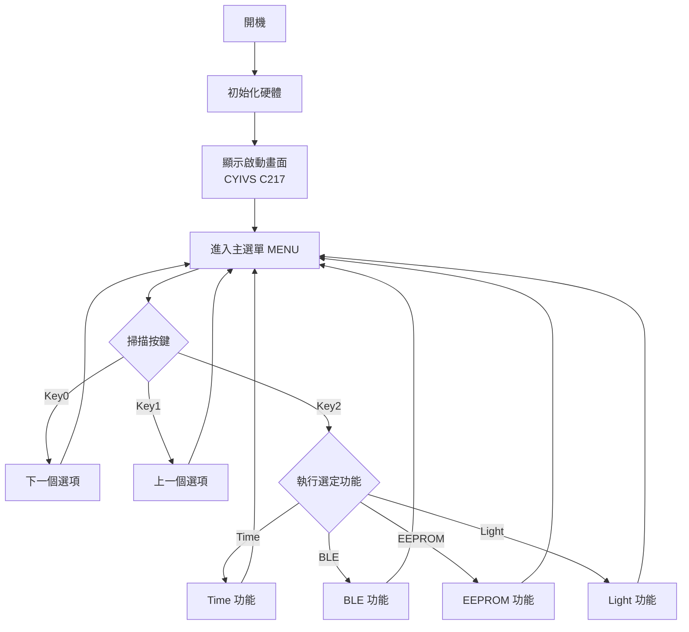
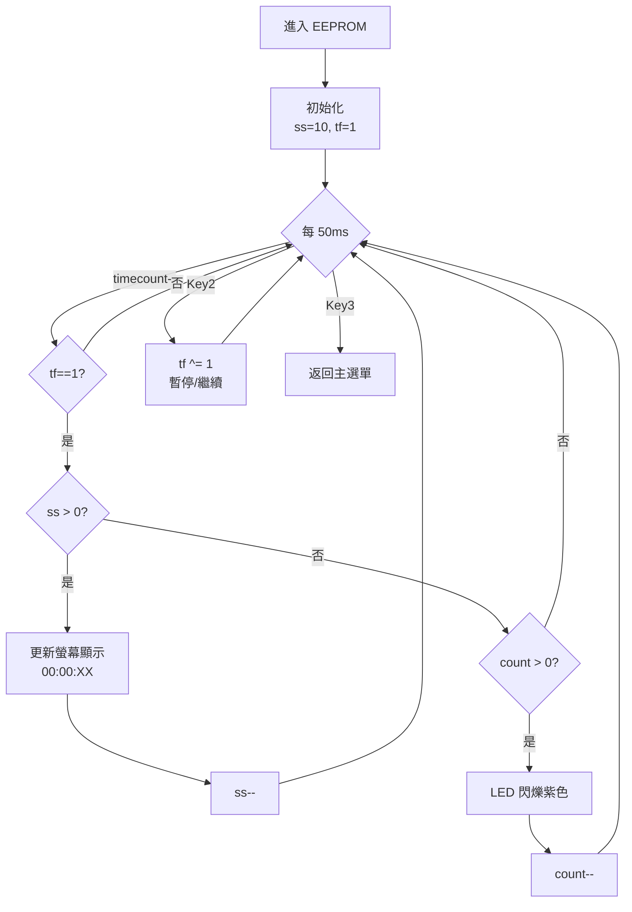

---

## 📋 目錄

1. [專案概述](#專案概述)
2. [硬體配置](#硬體配置)
3. [軟體架構](#軟體架構)
4. [功能詳解](#功能詳解)
5. [程式碼分析](#程式碼分析)
6. [技術特點](#技術特點)
7. [問題與建議](#問題與建議)

---

## 專案概述

這是一個基於 Arduino Uno 的互動式選單系統，整合了以下功能：
- TFT LCD 圖形化使用者介面
- WS2812B LED 燈條控制
- 按鍵輸入與選單導航
- 計時器中斷應用
- 多功能模式切換

**主要應用場景**: 工業技能競賽展示、嵌入式系統教學、互動裝置原型

---

## 硬體配置

### 1. TFT LCD 顯示器 (ST7735)

| 功能 | 腳位 | 說明 |
|------|------|------|
| CS (片選) | 10 | SPI 晶片選擇 |
| DC (資料/指令) | 8 | A0/RS 訊號 |
| MOSI (資料) | 18 | SPI 資料輸出 |
| SCLK (時鐘) | 19 | SPI 時鐘 |
| RST (重置) | 9 | 硬體重置 |
| BL (背光) | 6 | PWM 亮度控制 |

**規格**: 
- 解析度: 160×128 像素
- 色彩: 16-bit RGB565
- 介面: 軟體 SPI
- 旋轉: 橫向模式 (rotation=3)

### 2. NeoPixel LED 燈條 (WS2812B)

| 參數 | 設定值 |
|------|--------|
| 資料腳位 | PIN 5 |
| LED 數量 | 8 顆 |
| 亮度 | 50-100 (0-255) |
| 協定 | GRB + 800KHz |

**支援顏色**:
- 紅色: `0xff0000`
- 綠色: `0x00ff00`
- 藍色: `0x0000ff`
- 白色: `0x1f1f1f`
- 紫色: `0xff00ff`

### 3. 按鍵輸入

| 按鍵 | 腳位 | 功能 |
|------|------|------|
| Key 0 | PC0 (A0) | 下一個選項 |
| Key 1 | PC1 (A1) | 上一個選項 |
| Key 2 | PC2 (A2) | 確認/執行 |
| Key 3 | PC3 (A3) | 返回上層 |

**防彈跳機制**: 20ms 軟體掃描週期

### 4. 其他週邊

- **狀態指示燈**: PIN 13 (每秒閃爍)
- **計時器**: Timer1 硬體中斷

---

## 軟體架構

### 檔案結構

```
114-industrial-compe/
├── platformio.ini          # PlatformIO 組態檔
├── include/
│   └── Engnin_comp_2025.h  # 標頭檔與巨集定義
├── src/
│   └── main.cpp            # 主程式 (271 行)
└── lib/                    # 自訂函式庫目錄
```

### 相依函式庫

```ini
lib_deps = 
    adafruit/Adafruit GFX Library@^1.12.3
    adafruit/Adafruit SSD1306@^2.5.15
    adafruit/Adafruit NeoPixel@^1.15.2
    adafruit/Adafruit ST7735 and ST7789 Library@^1.11.0
```

### 選單層級結構

```
主選單 (MENU)
│
├─[1] Time          → Time() 函式
│   └─ (目前未實作具體功能)
│
├─[2] BLE           → BLE() 函式
│   ├─ Change Time      → stripmd(0, ...)
│   └─ Change EEPROM    → stripmd(1, ...)
│
├─[3] EEPROM        → EEPROM() 函式
│   └─ 倒數計時 + LED 閃爍
│
└─[4] Light         → Light() 函式
    ├─ mod 1            → stripmd(0, ...)
    ├─ mod 2            → stripmd(1, ...)
    └─ mod 3            → stripmd(2, ...)
```

---

## 功能詳解

### 1️⃣ Time 功能

**檔案位置**: `main.cpp` 第 135-138 行

```cpp
void Time() {
  while (keyC(3)) delay(10);
}
```

**功能說明**:
- ⏱️ 目前僅實作等待返回鍵的邏輯
- 🔧 預留空間可擴充時間設定功能

**建議擴充**:
- 顯示即時時間 (RTC 模組)
- 設定鬧鐘功能
- 時間格式切換 (12/24小時制)

---

### 2️⃣ BLE 功能

**檔案位置**: `main.cpp` 第 154-183 行

**子選單選項**:
1. **Change Time** - 修改時間設定
2. **Change EEPROM** - 修改記憶體資料

**操作流程**:
```
進入 BLE → 顯示 "Connect" 
    ↓
Key0/Key1 切換子選項
    ↓
Key2 確認 → 執行 stripmd() 顯示對應 LED
    ↓
Key3 返回主選單
```

**LED 顯示效果**:
- Change Time (index 0): 紅色 LED
- Change EEPROM (index 1): 綠色 LED

**程式碼片段**:
```cpp
void BLE() {
  tft_w(0, 50, 9, ST77XX_RED, "Connect", 0);
  // ... 選單邏輯 ...
  stripmd(page1, page_change[page1]);
}
```

---

### 3️⃣ EEPROM 功能

**檔案位置**: `main.cpp` 第 185-228 行

**核心功能**: 10秒倒數計時器 + LED 閃爍提示

**執行流程**:
```
啟動計時 (10秒)
    ↓
每秒更新螢幕顯示 "00:00:XX"
    ↓
Key2 可暫停/繼續
    ↓
倒數結束 → LED 閃爍紫色 3 次
    ↓
Key3 返回
```

**關鍵變數**:
- `ss`: 剩餘秒數 (初始值 10)
- `tf`: 計時開關旗標
- `timecount`: 50ms 計數器 (達到 1 秒)
- `count`: LED 閃爍次數 (6次 = 3個開關週期)

**LED 閃爍邏輯**:
```cpp
if (ss == 0 && count != 0) {
  if (!(count % 2)) strip.fill(0xff00ff, 0, 8);  // 紫色
  else strip.clear();                             // 熄滅
  strip.show();
  count--;
}
```

---

### 4️⃣ Light 功能

**檔案位置**: `main.cpp` 第 230-264 行

**燈光模式**:
| 模式 | 名稱 | LED顏色 | 索引 |
|------|------|---------|------|
| 模式1 | mod 1 | 紅色 | 0 |
| 模式2 | mod 2 | 綠色 | 1 |
| 模式3 | mod 3 | 藍色 | 2 |

**操作方式**:
1. Key0/Key1 選擇模式
2. Key2 執行 → 點亮對應位置的 LED
3. Key3 返回主選單

**視覺效果**:
- TFT 螢幕繪製 8 個圓形
- 選定的 LED 位置會填滿顏色
- NeoPixel 實體 LED 同步點亮

---

## 程式碼分析

### 核心函式說明

#### 1. `tft_w()` - TFT 文字輸出函式

```cpp
void tft_w(uint16_t x, uint16_t y, uint8_t pt, 
           uint16_t color, String wd, boolean inv)
```

**參數說明**:
- `x, y`: 文字座標
- `pt`: 字體大小 (9/12/18 pt)
- `color`: 文字顏色
- `wd`: 顯示字串
- `inv`: 反色模式 (true=黑底白字)

**特色**:
- ✅ 自動清除背景區域
- ✅ 支援多種字體大小
- ✅ 使用 FreeMono 等寬字型

**使用範例**:
```cpp
tft_w(25, 50, 18, ST77XX_RED, "CYIVS", 0);      // 紅色 18pt
tft_w(0, 70, 12, ST77XX_WHITE, "MENU", 0);      // 白色 12pt
tft_w(0, 50, 9, ST77XX_GREEN, "Connect", 0);    // 綠色 9pt
```

---

#### 2. `LED_on()` - 繪製 LED 外框

```cpp
void LED_on(int16_t Draw_Y, int16_t TFT_color)
```

**功能**: 在 TFT 螢幕上繪製 8 個空心圓形，代表 LED 位置

**座標陣列**:
```cpp
int16_t Circle_X[] = { 10, 30, 50, 70, 90, 110, 130, 150 };
```

**視覺效果**:
```
○  ○  ○  ○  ○  ○  ○  ○    ← 8個空心圓
```

---

#### 3. `show_LED()` - 顯示 LED 狀態

```cpp
void show_LED(int8_t LED, int16_t Draw_Y, int16_t TFT_color)
```

**功能**: 根據位元組值點亮對應的 LED

**範例**:
```cpp
show_LED(0b00000011, 60, ST77XX_RED);  // 點亮第 0、1 顆 LED
```

**位元對應**:
```
Bit:  7  6  5  4  3  2  1  0
LED:  ●  ●  ●  ●  ●  ●  ○  ○
```

**實作邏輯**:
```cpp
for (int i = 0; i < 8; i++) {
  if (bitRead(LED, i)) {
    tft.fillCircle(Circle_X[i], Draw_Y, 9, TFT_color);  // 填滿
  } else {
    tft.fillCircle(Circle_X[i], Draw_Y, 8, 0);          // 清除
  }
}
```

---

#### 4. `stripmd()` - NeoPixel 模式顯示

```cpp
void stripmd(uint8_t n, String wd)
```

**功能**: 整合螢幕與實體 LED 的顯示

**執行步驟**:
1. 清除螢幕
2. 繪製 LED 外框
3. 點亮第 n 個 LED (螢幕)
4. 顯示文字說明
5. 點亮第 n 個 NeoPixel (實體)
6. 等待 Key3 返回

**顏色對應**:
```cpp
uint32_t strip_col[] = { 
  0xff0000,  // [0] 紅色
  0x00ff00,  // [1] 綠色
  0x0000ff,  // [2] 藍色
  0x1f1f1f,  // [3] 白色
  0xff0000,  // [4] 紅色
  0xff0000   // [5] 紅色
};
```

---

#### 5. `convert24to16()` - 色彩轉換

```cpp
uint16_t convert24to16(uint32_t rgb)
```

**功能**: 將 24-bit RGB 轉換為 16-bit RGB565

**轉換公式**:
```
輸入:  RRRRRRRR GGGGGGGG BBBBBBBB  (24-bit)
         ↓         ↓         ↓
輸出:  RRRRR GGGGGG BBBBB           (16-bit)
       5-bit  6-bit  5-bit
```

**實作**:
```cpp
r = map(r, 0x00, 0xFF, 0x00, 0x1F) << 11;  // R: 5 bits
g = map(g, 0x00, 0xFF, 0x00, 0x3F) << 5;   // G: 6 bits
b = map(b, 0x00, 0xFF, 0x00, 0x1F);        // B: 5 bits
return r | g | b;
```

---

#### 6. Timer1 中斷服務

```cpp
ISR(TIMER1_OVF_vect) {
  TCNT1 = timer1_counter;
  cnt_1s ^= 1;
  digitalWrite(13, cnt_1s);
}
```

**功能**: 產生 1 秒週期的脈衝訊號

**計算方式**:
```
Timer1 溢位頻率 = 16MHz / 256 / 65536 = 0.95 Hz
預載值 = 65536 - 34286 = 31250
實際頻率 = 16MHz / 256 / 31250 = 2 Hz (0.5秒週期)
cnt_1s 切換 → 1 秒週期
```

**初始化**:
```cpp
timer_ini(34286);  // 設定預載值
```

---

### 按鍵處理機制

#### 巨集定義

```cpp
#define keyC(byte) (PINC & (1 << (byte)))
```

**功能**: 讀取 PORTC 的指定位元

**回傳值**:
- `0`: 按鍵被按下 (LOW)
- `非0`: 按鍵放開 (HIGH)

#### 防彈跳處理

```cpp
static uint32_t kt = millis();
static boolean kf0;

if ((millis() - kt) > 20) {  // 20ms 掃描週期
  kt = millis();
  if (kf0) {
    if (keyC(0) && keyC(1) && keyC(2) && keyC(3)) 
      kf0 = 0;  // 所有按鍵放開才重置
  } else if (!keyC(0)) {
    // 處理 Key0 按下
    kf0 = 1;  // 設定旗標防止重複觸發
  }
}
```

**機制說明**:
1. 每 20ms 檢查一次按鍵狀態
2. 使用 `kf0` 旗標防止連續觸發
3. 必須所有按鍵都放開才能重新觸發

---

## 技術特點

### ✅ 優點

1. **模組化設計**
   - 每個功能獨立成函式
   - 選單邏輯清晰易懂
   - 便於維護與擴充

2. **使用者介面**
   - 圖形化選單系統
   - 視覺回饋 (LED + 螢幕)
   - 直覺的按鍵操作

3. **硬體整合**
   - TFT LCD 顯示
   - NeoPixel 燈效
   - Timer 中斷應用
   - 多按鍵輸入

4. **防錯設計**
   - 按鍵防彈跳處理
   - 選單循環邊界檢查
   - 狀態旗標管理

5. **視覺效果**
   - 多種字體大小
   - 彩色文字顯示
   - LED 動態效果
   - 圓形圖示設計

---

### ⚠️ 問題與限制

#### 1. 程式碼問題

| 問題 | 位置 | 影響 |
|------|------|------|
| `Time()` 函式未實作 | 第 135 行 | 功能不完整 |
| 硬編碼魔術數字 | 多處 | 可維護性差 |
| 字串記憶體浪費 | 全域陣列 | RAM 佔用高 |
| 註解亂碼 | 標頭檔 | 可讀性差 |
| 缺少錯誤處理 | 全域 | 穩定性待加強 |

#### 2. 記憶體使用

**RAM 使用分析**:
```cpp
Adafruit_NeoPixel strip      → ~50 bytes
Adafruit_ST7735 tft          → ~100 bytes
String arrays                → ~100 bytes
uint32_t stripcolor[8]       → 32 bytes
其他變數                      → ~50 bytes
────────────────────────────────────
總計                          ≈ 332 bytes
```

**Arduino Uno 限制**:
- SRAM: 2048 bytes
- Flash: 32KB
- EEPROM: 1KB

**建議**: 改用 `PROGMEM` 儲存常數字串

#### 3. 效能考量

- ⏱️ 軟體 SPI 速度較慢
- 🔄 `String` 類別造成記憶體碎片
- 🎨 頻繁的螢幕重繪影響效能

---

## 建議改進方案

### 🔧 程式碼優化

#### 1. 實作 Time() 功能

```cpp
void Time() {
  uint8_t hours = 12, minutes = 0, seconds = 0;
  bool editing = false;
  
  tft_w(20, 50, 18, ST77XX_GREEN, 
        String(hours/10) + String(hours%10) + ":" +
        String(minutes/10) + String(minutes%10), 0);
  
  while (keyC(3)) {
    // TODO: 新增時間設定邏輯
    delay(10);
  }
}
```

#### 2. 使用 PROGMEM 節省 RAM

```cpp
const char menu_time[] PROGMEM = "Time";
const char menu_ble[] PROGMEM = "BLE";
const char menu_eeprom[] PROGMEM = "EEPROM";
const char menu_light[] PROGMEM = "Light";

const char* const page0_md[] PROGMEM = {
  menu_time, menu_ble, menu_eeprom, menu_light
};
```

#### 3. 定義常數取代魔術數字

```cpp
// 選單相關常數
#define MENU_ITEM_COUNT 4
#define MENU_TITLE_Y 25
#define MENU_ITEM_Y 70

// 按鍵掃描
#define KEY_SCAN_INTERVAL 20

// LED 相關
#define LED_CIRCLE_RADIUS 9
#define LED_CIRCLE_Y 60
```

#### 4. 改善錯誤處理

```cpp
bool initHardware() {
  // 初始化 NeoPixel
  strip.begin();
  if (!strip.canShow()) {
    return false;
  }
  
  // 初始化 TFT
  tft.initR(INITR_BLACKTAB);
  // 可加入校驗邏輯
  
  return true;
}
```

---

### 📈 功能擴充建議

#### 1. 新增 RTC 模組 (DS3231)

**功能**:
- 顯示即時時間
- 設定鬧鐘
- 時間記錄功能

**接線**:
```
DS3231 → Arduino
SDA    → A4
SCL    → A5
VCC    → 5V
GND    → GND
```

#### 2. EEPROM 資料儲存

**應用**:
- 儲存使用者設定
- 記錄歷史資料
- 開機載入預設值

```cpp
#include <EEPROM.h>

void saveSettings() {
  EEPROM.update(0, brightness);
  EEPROM.update(1, selectedMode);
}

void loadSettings() {
  brightness = EEPROM.read(0);
  selectedMode = EEPROM.read(1);
}
```

#### 3. 藍牙通訊 (HC-05)

**功能**:
- 手機 APP 控制
- 遠端參數調整
- 資料上傳

**指令範例**:
```cpp
if (Serial.available()) {
  String cmd = Serial.readStringUntil('\n');
  if (cmd == "LED_ON") {
    strip.fill(0xFFFFFF);
    strip.show();
  }
}
```

#### 4. 感測器整合

**建議感測器**:
- 🌡️ DHT22 溫濕度感測器
- 💡 LDR 光敏電阻
- 🎵 KY-038 聲音感測器

---

### 🎨 UI/UX 改善

#### 1. 進度條顯示

```cpp
void drawProgressBar(uint8_t x, uint8_t y, 
                     uint8_t w, uint8_t h, 
                     uint8_t percent) {
  tft.drawRect(x, y, w, h, ST77XX_WHITE);
  tft.fillRect(x+2, y+2, 
               (w-4)*percent/100, h-4, 
               ST77XX_GREEN);
}
```

#### 2. 圖示選單

```cpp
// 使用小型圖示取代純文字
void drawIcon(uint8_t x, uint8_t y, uint8_t type) {
  switch(type) {
    case ICON_TIME:
      // 繪製時鐘圖示
      break;
    case ICON_BLE:
      // 繪製藍牙圖示
      break;
  }
}
```

#### 3. 滑動動畫

```cpp
void slideTransition(int16_t direction) {
  for (int i = 0; i < 160; i += 10) {
    // 逐步移動螢幕內容
  }
}
```

---

## 測試建議

### 單元測試項目

- [ ] 按鍵輸入測試
- [ ] LED 顯示測試
- [ ] 選單導航測試
- [ ] 計時器精度測試
- [ ] 記憶體洩漏檢查

### 整合測試

- [ ] 長時間運行穩定性
- [ ] 各功能模組互動
- [ ] 邊界條件處理
- [ ] 按鍵快速連按測試

### 效能測試

- [ ] 螢幕更新速率
- [ ] 按鍵回應時間
- [ ] RAM 使用率監控
- [ ] Flash 空間餘裕

---

## 程式流程圖

### 主程式流程



### EEPROM 功能流程



---

## 附錄

### A. 完整腳位定義表

| 功能 | Arduino Pin | ATmega328P | 說明 |
|------|-------------|------------|------|
| TFT_CS | 10 | PB2 | SPI 晶片選擇 |
| TFT_DC | 8 | PB0 | 資料/指令選擇 |
| TFT_RST | 9 | PB1 | 硬體重置 |
| TFT_MOSI | 18 | PC4 | SPI 資料 |
| TFT_SCLK | 19 | PC5 | SPI 時鐘 |
| TFT_BL | 6 | PD6 | PWM 背光 |
| LED_PIN | 5 | PD5 | NeoPixel 資料 |
| RLED_PIN | 13 | PB5 | 板載 LED |
| Key0 | A0 | PC0 | 按鍵輸入 |
| Key1 | A1 | PC1 | 按鍵輸入 |
| Key2 | A2 | PC2 | 按鍵輸入 |
| Key3 | A3 | PC3 | 按鍵輸入 |

### B. 記憶體使用估算

```
Program Storage Space: ~18KB / 32KB (56%)
Dynamic Memory: ~650 bytes / 2048 bytes (31%)
```

### C. 相關資源

**官方文件**:
- [Adafruit NeoPixel Library](https://github.com/adafruit/Adafruit_NeoPixel)
- [Adafruit ST7735 Library](https://github.com/adafruit/Adafruit-ST7735-Library)
- [Arduino Timer Interrupts](https://www.arduino.cc/reference/en/language/functions/interrupts/interrupts/)

**參考資料**:
- WS2812B 資料手冊
- ST7735 控制器規格書
- ATmega328P 技術手冊

---

## 總結

這是一個結構完整、功能豐富的嵌入式系統專案，展現了以下技術能力：

✅ **硬體整合**: TFT LCD + NeoPixel + 按鍵輸入  
✅ **中斷應用**: Timer1 精確計時  
✅ **使用者介面**: 多層選單系統  
✅ **程式架構**: 模組化設計  

**適用場景**:
- 🏆 工業技能競賽
- 📚 嵌入式系統教學
- 🔧 互動裝置原型開發

**下一步建議**:
1. 完善 Time() 功能實作
2. 新增 RTC 模組支援
3. 實作 EEPROM 資料儲存
4. 整合藍牙通訊功能
5. 優化記憶體使用

---

**分析者**: GitHub Copilot  
**版本**: 1.0  
**最後更新**: 2025年11月5日
